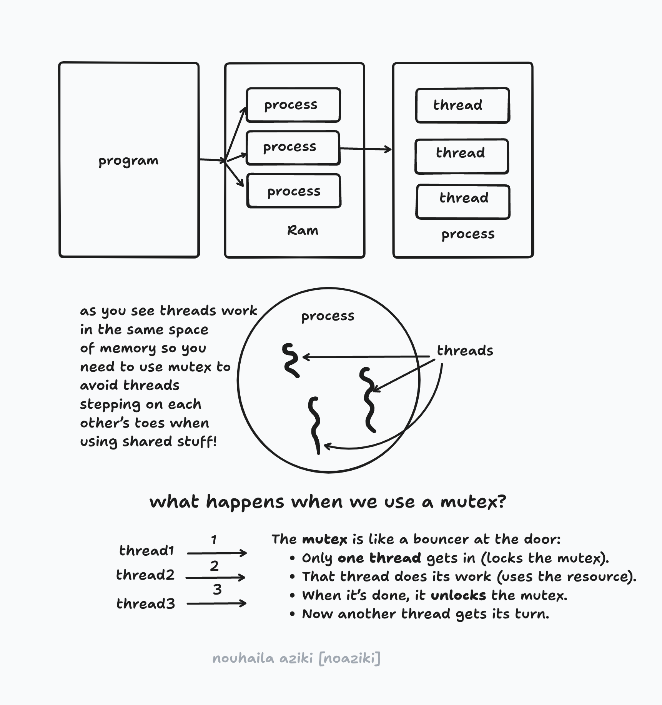

# Philosophers
A project involves simulating multiple philosophers sharing limited resources, using threads and mutexes to ensure synchronization and avoid issues like deadlocks and starvation. It focuses on multithreading and concurrency.

# Table of Contents

- [The Scenario](#the-scenario)
- [Explanation of Keys Concepts](#explanation-of-keys-concepts)
- [What Are Threads?](#what-are-threads)
- [Why Do We Use Threads?](#why-do-we-use-threads)
- [What Is a Mutex?](#what-is-a-mutex)
- [Why Do We Need Mutex?](#why-do-we-need-mutex)
- [Where Mutexes Work?](#where-mutexes-work)
- [Explanation of Some Staff](#explanation-of-some-staff)
- [Bonus Part: Philosophers Using Processes and Semaphores](#bonus-part-philosophers-using-processes-and-semaphores)
- [What Is a Process?](#what-is-a-process)
- [Threads vs Processes: The Key Differences](#threads-vs-processes-the-key-differences)
- [What Is a Semaphore?](#what-is-a-semaphore)
- [Why Use Semaphores?](#why-use-semaphores)
- [If You Don’t Use Semaphores with Multi-Processes](#if-you-dont-use-semaphores-with-multi-processes)
- [Mutex vs Semaphore: The Key Differences](#mutex-vs-semaphore-the-key-differences)
- [Explanation of some used fonctions in bonus](#explanation-of-some-used-fonctions-in-bonus)


# The Scenario
You have N philosophers sitting at a table.

Each philosopher alternates between:
 - Thinking

 - Eating

 - Sleeping

To eat, each philosopher needs 2 forks (left and right), but there's only one fork between each pair.

Each fork is a shared resource (represented with a mutex or semaphore).

# Explanation of keys concepts
## Deadlock
### Definition:
A deadlock happens when two or more threads (or processes) are waiting for each other to release resources, but none of them can proceed because they’re stuck in a circular wait.

### Example:
Imagine two threads:

- Thread A locks mutex 1, then tries to lock mutex 2

- Thread B locks mutex 2, then tries to lock mutex 1

Now:
```rust
Thread A is waiting for mutex 2 (held by B)

Thread B is waiting for mutex 1 (held by A)
```

Result: Both are stuck. This is deadlock.

```rust
Thread A: lock(mutex1) ---> waits for mutex2
Thread B: lock(mutex2) ---> waits for mutex1
```
They are waiting forever for each other.

## Race Condition
### Definition:
A race condition occurs when two or more threads access shared data at the same time, and the final result depends on the order of their execution.

### Example:
Suppose you have a global counter:

```c
int counter = 0;

void* increment(void* arg) {
    counter++;
}
```
If two threads run this at the same time, the ++ operation might conflict:

- Thread 1 reads counter = 0

- Thread 2 reads counter = 0

- Both increment and write 1

 !! Expected: 2 → Got: 1

### Why?
Because counter++ is not atomic. It involves:

Reading the value

Incrementing it

Writing it back

If not synchronized (e.g., using mutex), threads can interfere.


## What Are Threads?
If we don’t use threads,
our program will do things one by one—step after step.

But when we use threads,
it’s like having friends helping you clean your house:

- One cleans the kitchen,

- One vacuums,

- You’re doing your own thing.

Everyone is doing their task at the same time!
That’s exactly what happens when you use threads:
✅ Many tasks running in parallel.

## Why Do We Use Threads?
### Speed:
Tasks happen in parallel → Program finishes faster.

### Efficiency:
Makes better use of multi-core CPUs. No wasted power!

## !! One Important Thing to Know:
Multiple threads share the same memory space.
That’s why we use something called mutex:
To make sure threads don’t step on each other’s toes
when using shared resources!

## What Is a Mutex?
A mutex (short for Mutual Exclusion) is a tool used in programming, especially in multi-threaded applications, to control access to shared resources.
The mutex lets one thread at a time
 use the resource until this thread 
is completely done with it, 
then passes it to the next thread, 
again and again, until all threads 
finish their work.
 
 ## Why Do We Need mutex?
When multiple threads work at the same time, they might access or modify the same variable or resource.
If two threads change it at the same time: Boom! Race condition. Data gets corrupted.

We use a mutex to avoid that mess by:

- Locking before accessing shared resources.

- Unlocking when done.

## Where Mutexes Work?
A mutex (mutual exclusion lock) is a synchronization tool used inside a single process.

It’s specifically used between threads within that same process.



# Explanation of some staff
### pthread_mutex_t:
is a data type in the POSIX threads library (pthread) used to represent a mutex, which is a synchronization primitive that allows threads to protect shared data from concurrent access. It is a key component in multi-threaded programming for ensuring data consistency and preventing race conditions.
### pthread_mutex_init():
function initialises the mutex referenced by mutex with attributes specified by attr. If attr is NULL, the default mutex attributes are used; the effect is the same as passing the address of a default mutex attributes object. Upon successful initialisation, the state of the mutex becomes initialised and unlocked.
### gettimeofday():
It’s a C function that grabs the current time with microsecond precision, that's why we need struct timeval because It has two fields:

     - time_t      tv_sec;   // Whole seconds since Epoch (January 1, 1970)
     - suseconds_t tv_usec;  // Microseconds (1 second = 1,000,000 microseconds) -the remaining fraction of a second
Why Use struct timeval Instead of Just time_t?
- time_t only gives seconds — not enough if you need more precise timing.

- struct timeval gives you up to microseconds → perfect for performance measuring, simulation timing, precise logs, etc.

Why Set the Second Argument to NULL (gettimeofday(&tv, NULL)?

That second argument is officially:

```c
struct timezone *tz;
```

BUT:

It’s an old feature from before modern time libraries existed.

Almost nobody uses struct timezone anymore.

It’s marked as obsolete in most systems.

That’s why you always set it to NULL now.

### pthread_create():

This function is from the POSIX Threads (pthreads) library.
Its job is:
Create a new thread that starts running a specific function.
Every philosopher must have one thread.
```c
pthread_create(&sim->philos[i].thread, NULL, &philosopher_routine, &sim->philos[i]
```
For each philosopher, I create a new thread using pthread_create. I give it the default settings, tell it to run philosopher_routine, and pass it a pointer to the philosopher’s own struct so it knows who it’s dealing with."

pthread_create returns:
- 0 if everything went okay.
- A non-zero error code if something went wrong.

Why Would pthread_create() Fail?

1️⃣ System Limit Reached.

2️⃣ Not Enough Resources.

3️⃣ Invalid Attributes (rare here since we use NULL).

4️⃣ Invalid Arguments.

### pthread_join(): 
pthread_join(thread, NULL) waits for the specified thread to finish execution.

It blocks the calling thread (usually the main thread) until the thread terminates.

The second argument NULL means you don’t care about the thread’s return value.

### pthread_mutex_destroy():
It frees the system resources that were reserved for that mutex.

It’s like saying:

“Okay, I’m done using this lock, the program doesn’t need it anymore. Clean it up.”

Why Is It Important?
When you’re finished using mutexes (e.g., end of your program, simulation is over).

Mutexes are managed by the OS; if you don’t destroy them, you might leave behind unnecessary resources or memory usage.

That’s especially relevant if you create a lot of mutexes dynamically

---

# BONUS Part: Philosophers Using Processes and Semaphores
## What’s Different?
In the bonus version, instead of using threads, we use processes and semaphores.

## What Is a Process?
A process is an independent program instance with its own memory.

Unlike threads:

Processes don’t share memory.

Safer but more expensive (more system resources).

Each philosopher becomes a separate process.

## Threads vs Processes: The Key Differences

| Feature                | **Threads**                                                    | **Processes**                                                  |
|------------------------|----------------------------------------------------------------|----------------------------------------------------------------|
| **Definition**         | A lightweight unit of execution within a **single process**     | A heavyweight, independent instance of a **program**           |
| **Memory Space**       | **Shared memory** among threads                                 | **Separate memory** for each process                           |
| **Creation Speed**     | Faster (lighter, less overhead)                                 | Slower (heavier, more setup)                                   |
| **Communication**      | Easy via **shared variables**                                   | Requires **IPC** (e.g., pipes, semaphores, shared memory)      |
| **Crash Impact**       | If one thread crashes, **it may affect the whole process**      | If one process crashes, **others remain unaffected**           |
| **Isolation**          | Low — shared memory means less safety                           | High — processes are isolated and safer                        |
| **Resource Usage**     | Less (shares memory and code)                                   | More (each has its own memory and code)                        |
| **Use Case (Philo)**   | Used in the **mandatory part**                                  | Used in the **bonus part**                                     |
| **Synchronization Tool**| **Mutexes** (for shared data protection)                      | **Semaphores** (for inter-process communication)               |
| **Scheduling**         | Handled by the OS scheduler; usually **faster to context switch** | Also scheduled by OS; **heavier context switch**             |

## What Is a Semaphore?
A semaphore is like a traffic light 🚦.

It controls access to a resource by keeping a counter.

When the counter is above 0 → access allowed.

When it hits 0 → new processes must wait.

## Why Use Semaphores?
Since processes don’t share memory like threads, we need another way to coordinate access to shared things (like forks, printing to stdout).

Semaphores allow us to:

Let only a limited number of philosophers pick up forks.

Avoid deadlocks (by limiting access or ordering who eats).

Sync outputs (so logs don’t print at the same time).

## If you don’t use semaphores with multi-processes:
 ### 1. CRASH or behave unpredictably
Processes do not share memory like threads.

So without semaphores, each philosopher process works blindly, without knowing what the others are doing.

They’ll:

Pick up the same forks at the same time

Overlap prints

Mess up death detection and eating counts

 ### 2. Forks won’t be protected (→ double grabbing)
Each philosopher will try to access the shared forks variable directly.

This causes multiple philosophers to grab the same fork at the same time, because there’s no protection mechanism.

- Result: Unrealistic or broken simulation — sometimes a philosopher eats without two forks, which breaks the logic.

### Final Answer:
If you don’t use semaphores in the bonus part, your program will break.
You’ll face:

- Race conditions

- Data corruption

- Deadlocks

- Garbage output

- Memory leaks

- Failed logic

Semaphores are not optional in the bonus part — they are the backbone of inter-process coordination.

## Mutex vs Semaphore: The Key Differences

| Feature           | Mutex                                                      | Semaphore                                                         |
|------------------|-------------------------------------------------------------|--------------------------------------------------------------------|
| **Basic Idea**    | A lock used to protect a single shared resource            | A signaling mechanism to manage access to multiple instances of a resource |
| **Value Range**   | Only 0 or 1 (locked/unlocked)                              | Any non-negative integer ≥ 0                                       |
| **Ownership**     | Only the thread that locks it can unlock it               | Any process/thread can increment or decrement it                   |
| **Use Case**      | Synchronizing threads within the same process              | Synchronizing multiple processes or threads                        |
| **Deadlock Risk** | Higher if not used carefully                               | Less direct, but misuse can still cause issues                     |
| **Blocking Behavior** | Blocks other threads if already locked               | Blocks when the value is 0                                         |
| **Shared Memory?**| No (used inside a process with shared memory)              | Yes (can be used across multiple processes)                        |

## Explanation of some used fonctions in bonus

### pthread_detach()
Purpose: Detach a thread so its resources are automatically released when it finishes.

```c
int pthread_detach(pthread_t thread);
```
Usage:

You don't need to pthread_join a detached thread.

Use this when you don’t care about the return value of the thread.

### waitpid()
Purpose: Wait for a specific child process to terminate.

```c
pid_t waitpid(pid_t pid, int *status, int options);
```
Usage:

pid = child process ID.

status will contain exit info.

Use -1 to wait for any child process.

Can be non-blocking with WNOHANG.

### sem_open()
Purpose: Opens or creates a named semaphore.

```c
sem_t *sem_open(const char *name, int oflag, mode_t mode, unsigned int value);
```
Usage:

name is like a file path (e.g., "/sem_name").

If O_CREAT is passed in oflag, creates the semaphore with initial value.

```c
sem_t *sem = sem_open("/mysem", O_CREAT, 0644, 1);
```
### sem_close()
Purpose: Closes a named semaphore.

```c
int sem_close(sem_t *sem);
```
Usage:

Doesn't remove the semaphore; just closes your process’s access to it.

### sem_post()
Purpose: Increments (unlocks) the semaphore.

```c
int sem_post(sem_t *sem);
```
Usage:

Signals that a resource is available.

Increments the value; wakes up waiting processes if any.

### sem_wait()
Purpose: Decrements (locks) the semaphore.

```c
int sem_wait(sem_t *sem);
```
Usage:

If the semaphore’s value is 0, the call blocks until it becomes > 0.

Otherwise, it decrements the value and continues.

### sem_unlink()
Purpose: Removes a named semaphore from the system.

```c
int sem_unlink(const char *name);
```
Usage:

Use this when you're done with the semaphore forever.

Think of it like deleting a file from the system.
